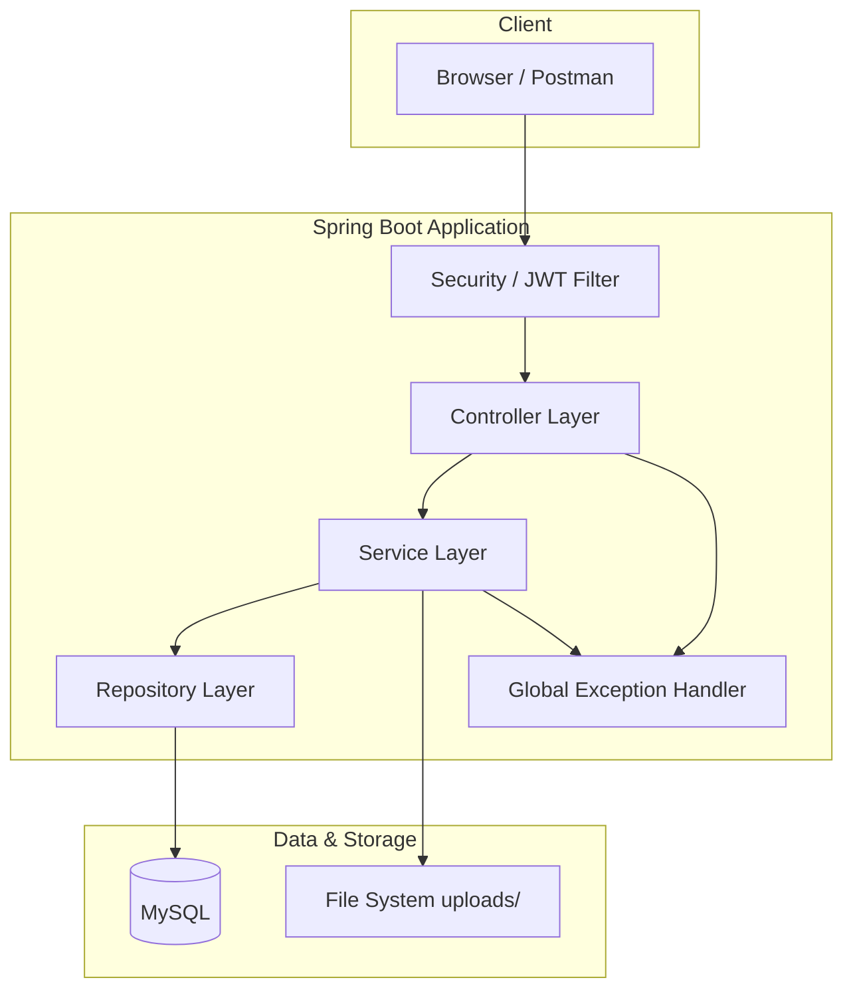
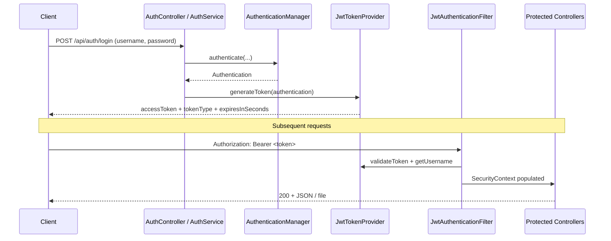

# 🔐 Secure Document Sharing System

> A **final-year major project**–style backend for **secure document sharing**, built with **Java 18**, **Spring Boot 3**, **Spring Security**, **JWT**, **MySQL**, and **REST APIs**. Users register, authenticate with Bearer tokens, upload files, and generate **time-limited, UUID-based share links** for **public download** without login.

---

## 📋 Table of Contents

1. [Project Description](#project-description)
2. [Features](#features)
3. [Tech Stack](#tech-stack)
4. [Architecture](#architecture)
5. [Folder / Package Structure](#folder--package-structure)
6. [Database Configuration](#database-configuration)
7. [API Reference](#api-reference)
8. [JWT Authentication Flow](#jwt-authentication-flow)
9. [File Upload Flow](#file-upload-flow)
10. [Share-Link Generation Flow](#share-link-generation-flow)
11. [Link Expiry Validation Flow](#link-expiry-validation-flow)
12. [Setup & Installation](#setup--installation)
13. [How to Run](#how-to-run)
14. [Testing with Postman](#testing-with-postman)
15. [Future Enhancements](#future-enhancements)
16. [GitHub Repository](#github-repository)
17. [Screenshots](#screenshots)
18. [Author](#author)

---

## 🎯 Project Description

The **Secure Document Sharing System** is a **layered Spring Boot application** that lets users:

- **Register** and **log in** to obtain a **JWT access token**
- **Upload** documents (stored on disk + metadata in **MySQL**)
- **List** and **inspect** their own documents
- **Create share links** that embed a **random UUID token**, valid for **5 minutes**
- Allow **anyone** with the link to **download** the file via a **public** endpoint (no JWT), while the server validates the token, expiry, and file presence and **logs access outcomes**

A **Thymeleaf / HTML / CSS / JavaScript** UI is **started** under `src/main/resources/templates` and `static` for future full-stack integration; the core deliverable is the **REST API** secured with **Spring Security** and **JWT**.

---

## ✨ Features

| Area | Capability |
|------|------------|
| **Auth** | User registration, login, **BCrypt** password hashing, **JWT** issuance |
| **Documents** | Multipart **file upload**, per-user listing, fetch by ID (owner-only) |
| **Sharing** | **UUID** share tokens, **5-minute** automatic expiry, absolute `shareUrl` in API response |
| **Public download** | `GET /api/share/{token}` — **no Bearer token**; attachment response with correct content type when available |
| **Security** | Stateless sessions, JWT filter, protected routes except auth + public share GET |
| **Persistence** | **JPA/Hibernate** with **MySQL**; entities for users, documents, share links, access logs |
| **API quality** | Centralized **exception handling**, structured **JSON errors**, validation messages |
| **Observability** | **Access logging** for share downloads (success, expired, not found, etc.) |
| **CORS** | `WebConfig` allows configured methods on `/api/**` |
| **Tooling** | **Maven**, **Lombok**, **Postman**-friendly JSON APIs |

---

## 🛠 Tech Stack

| Technology | Role |
|-------------|------|
| **Java 17** | Language |
| **Spring Boot 3.5.x** | Application framework |
| **Spring Security** | Authentication, authorization, JWT filter chain |
| **Spring Data JPA** | ORM & repositories |
| **JJWT 0.12.x** | Create & validate HS256 JWTs |
| **MySQL** | Primary database |
| **Maven** | Build & dependency management |
| **Lombok** | Boilerplate reduction |
| **Jakarta Validation** | Request DTO validation |
| **Thymeleaf** | Server-side templates (UI integration started) |
| **HTML / CSS / JS** | Static assets & front-end integration (in progress) |
| **H2** (test scope) | Optional in-memory DB for tests |
| **Postman** | Manual API testing |

---

## 🏛 Architecture

The project follows **classic layered architecture** with clear separation of concerns:



- **Controllers** expose REST endpoints and map HTTP to service calls.
- **Services** hold business rules (ownership, share expiry, file resolution).
- **Repositories** encapsulate database access.
- **DTOs** decouple API contracts from JPA entities.
- **Mappers** translate entities ↔ API responses.
- **Security** configures JWT extraction, validation, and `SecurityContext`.
- **Exceptions** signal domain failures; **GlobalExceptionHandler** returns consistent JSON.

---

## 📁 Folder / Package Structure

```
src/main/java/com/project/secure_document_sharing/
├── SecureDocumentSharingApplication.java   # Entry point + @EnableConfigurationProperties
├── config/                                 # Spring configuration (Security, JWT props, CORS, storage, share URL)
├── controller/                             # REST endpoints (auth, documents, public share download)
├── service/                                # Business logic (auth, documents, share links, storage, access logs)
├── repository/                             # Spring Data JPA interfaces
├── entity/                                 # JPA entities (User, Document, ShareLink, AccessLog, enums)
├── dto/
│   ├── request/                            # Incoming payloads (register, login)
│   └── response/                           # Outgoing payloads (auth, document, share link, errors)
├── mapper/                                 # Entity → response mapping
├── security/                               # JWT provider, filter, user details, constants
├── util/                                   # Filename sanitization & upload validation helpers
└── exception/                              # Custom exceptions + @RestControllerAdvice handler
```

| Package | Purpose |
|---------|---------|
| **`controller`** | Defines REST routes, HTTP status codes, `multipart/form-data` upload, public share download. |
| **`service`** | Registration/login, document CRUD & upload paths, share-link lifecycle, access audit, file I/O orchestration. |
| **`repository`** | JPA queries for `User`, `Document`, `ShareLink`, `AccessLog`. |
| **`dto`** | Stable JSON shapes; validation annotations on **request** DTOs. |
| **`entity`** | Database tables & relationships (`users`, `documents`, `share_links`, access logs). |
| **`security`** | `JwtTokenProvider`, `JwtAuthenticationFilter`, `UserDetailsService` integration. |
| **`util`** | Cross-cutting helpers (e.g. safe filenames, upload constraints). |
| **`mapper`** | Keeps controllers thin by centralizing response construction. |
| **`exception`** | Typed errors (`Conflict`, `Forbidden`, `ShareLinkExpired`, etc.) + global handler. |
| **`config`** *(extra)* | `SecurityConfig`, `WebConfig`, typed `@ConfigurationProperties` for JWT, storage, share base URL. |

**Resources**

- `src/main/resources/application.properties` — datasource, JWT, multipart limits, storage path, public share base URL  
- `src/main/resources/templates/` — Thymeleaf pages (e.g. login, register, dashboard) — **UI started**  
- `src/main/resources/static/` — CSS/JS assets  

---

## 🗄 Database Configuration

1. **Create a MySQL schema** (name should match your JDBC URL), for example:

   ```sql
   CREATE DATABASE secure_document_sharing CHARACTER SET utf8mb4 COLLATE utf8mb4_unicode_ci;
   ```

2. **Configure** `src/main/resources/application.properties` (use **your** credentials; avoid committing real secrets):

   | Property | Description |
   |----------|-------------|
   | `spring.datasource.url` | JDBC URL, e.g. `jdbc:mysql://localhost:3306/secure_document_sharing` |
   | `spring.datasource.username` / `password` | MySQL user |
   | `spring.jpa.hibernate.ddl-auto` | `update` for dev (auto schema sync) |
   | `app.jwt.secret` | **HS256** secret — use a **long random** string in production |
   | `app.jwt.expiration-minutes` | Access token lifetime (e.g. `60`) |
   | `app.jwt.issuer` | JWT `iss` claim |
   | `app.storage.root-directory` | Directory for uploaded files (e.g. `uploads`) |
   | `app.share.public-base-url` | Origin used to build full `shareUrl` (no trailing slash), e.g. `http://localhost:8080` |

3. **Tables** (created/updated by JPA from entities) include:

   - **`users`** — `id`, unique `username`, `password` (BCrypt), `enabled`  
   - **`documents`** — file metadata, `owner_id`, `stored_path`, timestamps  
   - **`share_links`** — `token` (UUID string), `expires_at`, `created_at`, FK to document  
   - **Access log** table — records share download attempts and outcomes  

---

## 📡 API Reference

**Base URL (local default):** `http://localhost:8080`

**Auth header (protected routes):** `Authorization: Bearer <accessToken>`

### Summary

| Method | Endpoint | Auth | Description |
|--------|----------|------|-------------|
| `POST` | `/api/auth/register` | No | Create account |
| `POST` | `/api/auth/login` | No | Obtain JWT |
| `POST` | `/api/documents` | Bearer | Multipart file upload (`file`) |
| `GET` | `/api/documents` | Bearer | List current user’s documents |
| `GET` | `/api/documents/{id}` | Bearer | Get metadata if owned |
| `POST` | `/api/documents/{id}/share` | Bearer | Create 5-minute share link |
| `GET` | `/api/share/{token}` | No | Public file download |

---

### 1. Register

**Request**

`POST /api/auth/register`  
`Content-Type: application/json`

```json
{
  "username": "alice",
  "password": "password12"
}
```

**Validation notes**

- `username`: required, max 128 chars  
- `password`: required, **min 8**, max 128 chars  

**Responses**

| Status | Meaning |
|--------|---------|
| `201 Created` | User created (empty body) |
| `409 Conflict` | Username already taken |
| `400 Bad Request` | Validation failed |

**Example error (`409`)**

```json
{
  "timestamp": "2026-05-14T12:00:00Z",
  "status": 409,
  "error": "Conflict",
  "message": "Username already taken",
  "path": "/api/auth/register",
  "code": null
}
```

---

### 2. Login

**Request**

`POST /api/auth/login`  
`Content-Type: application/json`

```json
{
  "username": "alice",
  "password": "password12"
}
```

**Response `200 OK`**

```json
{
  "accessToken": "eyJhbGciOiJIUzI1NiIsInR5cCI6IkpXVCJ9...",
  "tokenType": "Bearer",
  "expiresInSeconds": 3600
}
```

**Example error (`401`)**

```json
{
  "timestamp": "2026-05-14T12:00:00Z",
  "status": 401,
  "error": "Unauthorized",
  "message": "Invalid credentials",
  "path": "/api/auth/login",
  "code": null
}
```

---

### 3. Upload document

**Request**

`POST /api/documents`  
`Authorization: Bearer <token>`  
`Content-Type: multipart/form-data`

| Part | Type | Description |
|------|------|-------------|
| `file` | File | Document to store |

**Response `201 Created`**

```json
{
  "id": 1,
  "originalFilename": "report.pdf",
  "contentType": "application/pdf",
  "sizeBytes": 245678,
  "createdAt": "2026-05-14T12:05:00"
}
```

**Limits (default in `application.properties`)**

- Per-file max: **50MB**  
- Max request size: **55MB**  
- Oversize → `413 Payload Too Large` with JSON error body  

---

### 4. List documents

**Request**

`GET /api/documents`  
`Authorization: Bearer <token>`

**Response `200 OK`**

```json
[
  {
    "id": 1,
    "originalFilename": "report.pdf",
    "contentType": "application/pdf",
    "sizeBytes": 245678,
    "createdAt": "2026-05-14T12:05:00"
  }
]
```

---

### 5. Get document by ID

**Request**

`GET /api/documents/{id}`  
`Authorization: Bearer <token>`

**Response `200 OK`** — same shape as one element in the list above.

**Errors**

- `404` — document not found or not owned  
- `403` — not allowed  

---

### 6. Create share link

**Request**

`POST /api/documents/{id}/share`  
`Authorization: Bearer <token>`

No body.

**Response `201 Created`**

Headers include **`Location`** set to the same URL as `shareUrl`.

```json
{
  "token": "3fa85f64-5717-4562-b3fc-2c963f66afa6",
  "shareUrl": "http://localhost:8080/api/share/3fa85f64-5717-4562-b3fc-2c963f66afa6",
  "expiresAt": "2026-05-14T12:10:00",
  "documentId": 1
}
```

**Notes**

- Token is a **UUID v4** string (validated on download).  
- **`expiresAt`** is **5 minutes** after creation (`SHARE_EXPIRY_MINUTES` in `ShareLinkService`).  
- Only the **document owner** may create a link (`403` otherwise).  

---

### 7. Public download (no JWT)

**Request**

`GET /api/share/{token}`

**Response `200 OK`**

- Binary stream with `Content-Type` from stored metadata when valid  
- `Content-Disposition: attachment; filename="..."`  

**Errors**

| Status | Scenario |
|--------|----------|
| `404` | Invalid token format, unknown token, or missing file on disk |
| `410 Gone` | Link expired |

**Example expired response**

```json
{
  "timestamp": "2026-05-14T12:15:00Z",
  "status": 410,
  "error": "Gone",
  "message": "This share link has expired. Request a new share link from the document owner.",
  "path": "/api/share/3fa85f64-5717-4562-b3fc-2c963f66afa6",
  "code": "SHARE_LINK_EXPIRED"
}
```

---

## 🔑 JWT Authentication Flow



1. Client sends **username/password** to `/api/auth/login`.  
2. **Spring Security** validates credentials via `AuthenticationManager`.  
3. **JwtTokenProvider** builds a signed JWT (`iss`, `sub` = username, `exp`).  
4. Client stores `accessToken` and sends **`Authorization: Bearer <token>`** on protected routes.  
5. **JwtAuthenticationFilter** runs **before** controllers: if the token is valid, loads `UserDetails` and sets **`SecurityContextHolder`**.  
6. Invalid/missing token on protected routes → **401 Unauthorized** (Spring Security default behavior).

---

## 📤 File Upload Flow

1. Client sends **`multipart/form-data`** with part name **`file`** to `POST /api/documents` **with Bearer JWT**.  
2. **DocumentController** delegates to **DocumentService**.  
3. Service resolves **current user** from security context, validates/stores the file under **`app.storage.root-directory`**, and persists a **Document** row (original name, stored path, content type, size, timestamp).  
4. **`201 Created`** returns **DocumentResponse** JSON (no raw file path exposure beyond business fields).

---

## 🔗 Share-Link Generation Flow

1. Authenticated owner calls **`POST /api/documents/{id}/share`**.  
2. **ShareLinkService** verifies document exists and **owner matches** current user.  
3. New **ShareLink** row: **`token` = UUID.randomUUID()**, **`expiresAt` = now + 5 minutes**.  
4. **`shareUrl`** = `app.share.public-base-url` + `/api/share/` + `token` (no trailing slash on base).  
5. Response includes **`Location`** header = `shareUrl` for REST clients.

---

## ⏱ Link Expiry Validation Flow

1. Anonymous client calls **`GET /api/share/{token}`**.  
2. Token must match a **strict UUID regex**; otherwise treated as **not found** (`404`) and logged.  
3. If no DB row for token → **404** + access log.  
4. If **`expiresAt` is not after `now`** → **ShareLinkExpiredException** → **`410 Gone`** with **`code: SHARE_LINK_EXPIRED`** + access log **EXPIRED**.  
5. If file missing on disk → **404** + log.  
6. On success → stream file, **`200`**, access log **SUCCESS**.

---

## 🧰 Setup & Installation

### Prerequisites

- **JDK 17**  
- **Maven 3.8+** (or use included **Maven Wrapper**)  
- **MySQL 8.x**  
- **Git**  

### Clone

```bash
git clone https://github.com/<your-username>/<your-repo>.git
cd secure_document_sharing
```

### Database

Create the schema and a MySQL user with appropriate privileges, then align **`application.properties`** with your environment.

### Security checklist (important)

- Replace **`app.jwt.secret`** with a **strong random** value (HS256 needs sufficient length; follow your ops policy).  
- Use **environment-specific** properties or **environment variables** for secrets in production.  
- Do **not** commit production passwords or keys to Git.

---

## ▶️ How to Run

From the project root:

```bash
./mvnw spring-boot:run
```

On Windows (PowerShell):

```powershell
.\mvnw.cmd spring-boot:run
```

Or build a JAR and run:

```bash
./mvnw clean package
java -jar target/secure_document_sharing-0.0.1-SNAPSHOT.jar
```

Default port: **8080** (unless overridden, e.g. `server.port` in properties).

---

## 🧪 Testing with Postman

1. **Create a collection** with a variable `baseUrl` = `http://localhost:8080`.  
2. **Register** — `POST {{baseUrl}}/api/auth/register` with raw JSON body.  
3. **Login** — `POST {{baseUrl}}/api/auth/login`; copy `accessToken`.  
4. **Set collection/folder auth** — Type **Bearer Token**, paste the token (or use a **Tests** script to save `pm.collectionVariables.set("token", json.accessToken)`).  
5. **Upload** — `POST {{baseUrl}}/api/documents` → **Body** → **form-data** → key `file` (type **File**).  
6. **Share** — `POST {{baseUrl}}/api/documents/1/share` with Bearer token; copy `shareUrl`.  
7. **Download** — new request **without** Authorization: `GET` the `shareUrl` → **Send and Download**.  
8. **Expiry** — wait **5+ minutes** and repeat step 7 → expect **`410`** JSON with `SHARE_LINK_EXPIRED`.

> **Tip:** Enable **Postman Console** to inspect redirects, headers (`Location`), and response times.

---

## 🚀 Future Enhancements

- **Refresh tokens** & token revocation blacklist  
- **Role-based access** (admin vs user) and fine-grained document permissions  
- **Configurable share TTL** via `application.properties` instead of constant only  
- **Virus scanning** / content inspection pipeline for uploads  
- **S3-compatible object storage** instead of local disk  
- **Rate limiting** on login and public share endpoints  
- **Email / magic-link** delivery of share URLs  
- **Complete Thymeleaf SPA** wiring: login → dashboard → upload → copy link UI  
- **OpenAPI (Swagger)** documentation and contract tests  
- **Docker Compose** for MySQL + app one-command demo  

---

## 📦 GitHub Repository

| Item | Link / Note |
|------|-------------|
| **Repository** | `https://github.com/<your-username>/<your-repo>` ← replace with your actual GitHub URL |
| **Clone** | `git clone https://github.com/<your-username>/<your-repo>.git` |
| **Issues / PRs** | Use GitHub Issues for bugs and Discussions for questions |

> **GitHub integration** is completed on your side once the remote is set and the repository is public or shared with evaluators.

---

## 📸 Screenshots

> Add images under e.g. `docs/screenshots/` and link them here for your project report / viva.

| # | Placeholder | Suggested content |
|---|-------------|-------------------|
| 1 | `` | Login request + `accessToken` in response |
| 2 | `` | Multipart upload with Bearer auth |
| 3 | `` | `201` + `shareUrl` / `Location` header |
| 4 | `` | Public GET share URL → file download |
| 5 | `` | `410` + `SHARE_LINK_EXPIRED` |
| 6 | `` | Schema / sample rows |
| 7 | `` | Thymeleaf login page (when wired) |

---

## 👤 Author

| Field | Value |
|-------|-------|
| **Name** | *Your Name* |
| **Institution** | *Your College / University* |
| **Course** | *e.g. B.Tech / MCA — Final Year Major Project* |
| **Contact** | *your.email@example.com* |
| **Year** | 2026 |

---

## 📄 License

Specify your license here (e.g. **MIT**, educational use only, or institute policy).

---

<p align="center">
  <b>Secure Document Sharing System</b><br/>
  <sub>Spring Boot · Spring Security · JWT · MySQL · REST</sub>
</p>
